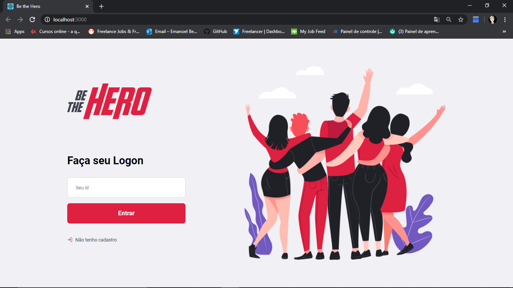
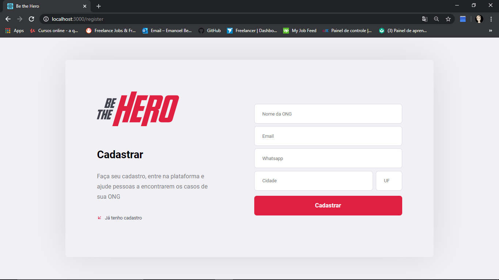
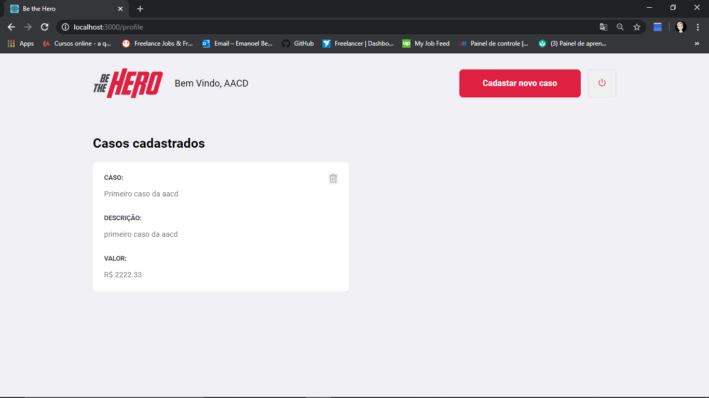
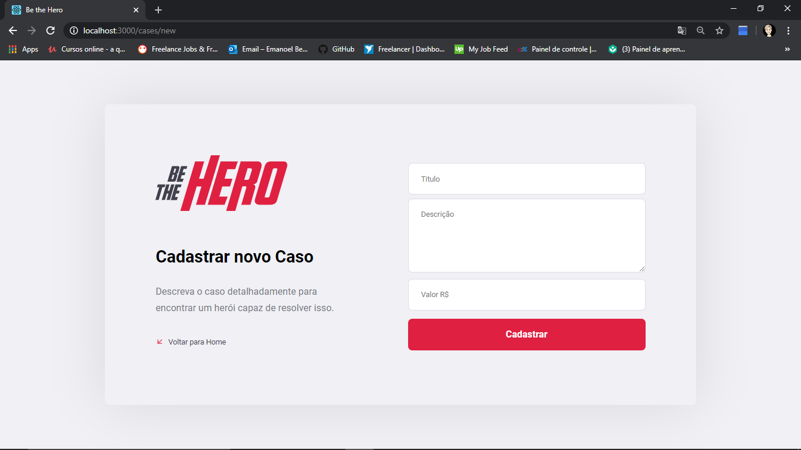

## BE THE HERO

Este projeto foi criado com o intuito de aprofundar os conhecimentos em nodeJS, React js e React-native. Consiste em um sistema no qual ongs podem divulgar casos nos quais elas estão trabalhando a fim de receber ajuda dos usuários através do aplicativo mobile. Tendo o seguinte funcionament: 
- A ong se cadastra na plataforma Web, e logo em seguida recebe um token de acesso
- Após concluir o cadastro e receber o token a ONG pode entrar normalmente na plataforma 
- Em seguida, a mesma pode incluir novos casos constando todas as informações requeridas, podendo excluir posteriormente 
- Por fim, o usuário que esteja disposto a ajudar entra no app mobile e visualiza todos os casos disponiveis, podendo entrar em contato via E-mail ou Whatsapp
 
## Tecnologias usadas:
- Banco de dados SQLite 
- http requests com Axios
- Knex para o acesso ao banco de dados no servidor

## Scripts
*Ao entrar nos respectivos diretorios usando o terminal como administrador, rode:

- Backend:
### `yarn start` ou `npm start`

- Frontend: 
### `yarn start`

- Mobile:
### `expo start`

## Interface Web

### Login da ONG

### Cadastro da ONG

### Home page

### Cadastro dos casos da ONG

